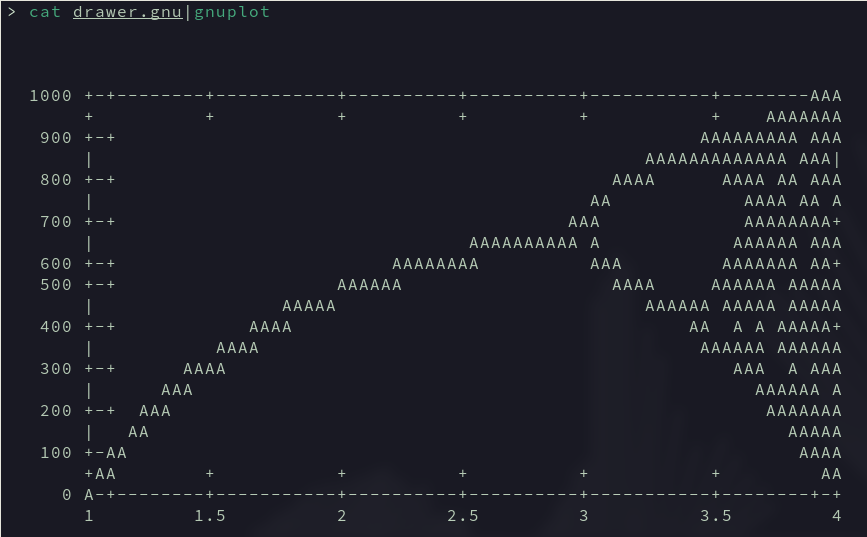

Bombyx
======

Program to plot the evolution of an animal species.

```
USAGE  
 ./bombyx n [k | i0 i1] > data

DESCRIPTION  
    n number of first generation individuals  
    k growth rate from 1 to 4  
    i0 initial generation (included)  
    i1 final generation (included)
```

The program will output plot data under a file named data.

This data can be visualized using GNU's program gnuplot on par with the drawer.gnu file's instructions.

To see the data plotted, use the command `cat drawer.gnu |gnuplot`



To compile, use the ``make`` command, to remove all compiled files, use the ``
make fclean command``
